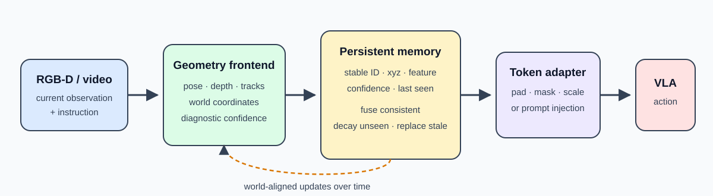
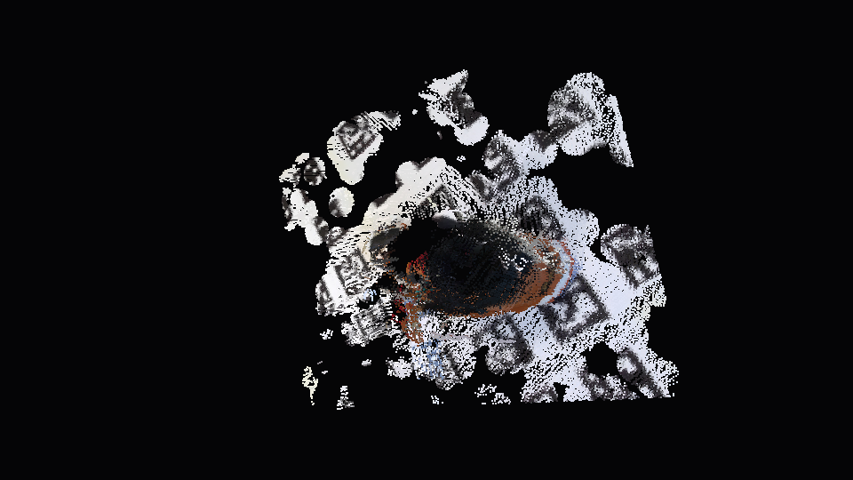
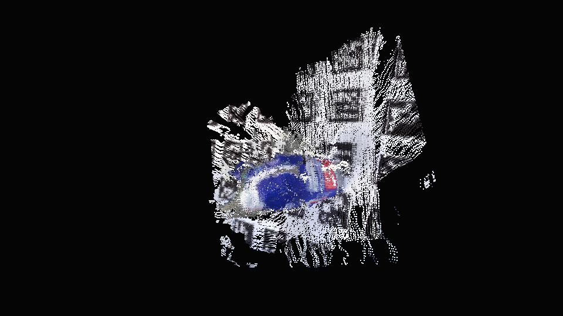

# Persistent 3D Scene Memory for Vision-Language-Action Policies

A research prototype connecting multi-view 3D reconstruction, confidence-aware
scene memory, and [SmolVLA](https://huggingface.co/lerobot/smolvla_base) control
in RoboCasa.

The project asks:

> Can persistent, world-aligned geometry help a VLA act when its current view is
> incomplete, and can geometric confidence prevent stale memory from hurting
> the policy?



## Highlights

- Built a causal world-frame memory with stable IDs, confidence decay,
  consistency-gated updates, age tracking, and fixed-size geometry tokens.
- Connected three live RoboCasa RGB views and 16D proprioception to SmolVLA and
  mapped its output to the simulator's native 12D arm, gripper, and mobile-base
  controls.
- Fine-tuned and evaluated SmolVLA using 42,624 native demonstration actions,
  2,122 causal RGB anchors, official RoboCasa data, and locally collected
  mobile-base demonstrations.
- Implemented a 4.65M-parameter geometry cross-attention connector and a
  six-skill hierarchical VLA scaffold.
- Retained negative results and promotion gates: improved imitation error does
  not yet produce learned closed-loop task success.

## Results

### Confidence-aware memory

Across 480 controlled episodes covering occlusion, pose/depth noise, and object
movement:

| Policy input | Action error ↓ | Confidence Brier ↓ | Availability ↑ |
|---|---:|---:|---:|
| Current RGB only | 0.6230 | 0.0630 | 0.5747 |
| Short RGB history | 0.4269 | 0.1013 | 0.7662 |
| Persistent geometry, no gating | 0.2054 | 0.2522 | 1.0000 |
| **Confidence-aware persistent geometry** | **0.1748** | **0.1217** | **1.0000** |

Confidence gating reduced action error by **14.9%** and confidence Brier score
by **51.7%** relative to ungated persistence. This validates the memory
mechanism in a controlled setting, not yet with a successful learned policy.

### SmolVLA and RoboCasa

- Best held-out imitation RMSE: **0.2662**, versus **0.4014** for zero action.
- Real local closed-loop bridge: three RGB cameras, 16D state, 12D native
  control, and separate CUDA/MuJoCo Python environments over loopback RPC.
- The strongest monolithic policy still fails the held-out task and keeps the
  gripper closed for 99.3% of frames.
- A privileged hierarchical controller succeeds in 356 frames, showing that
  the skill decomposition can solve the task; the learned skill selector does
  not yet pass its generalization gate.

The current scientific bottleneck is successful correction data from
policy-visited states. Geometry-memory policy ablations are intentionally
deferred until the RGB-only policy achieves nonzero closed-loop success.

### Causal reconstruction and memory

An eight-frame acquisition-order experiment reconstructed 741 stable point
identities with zero merges or splits. Its final memory contained 320 current
and 391 persisted tokens, with a final nearest-ground-truth proxy error of
0.0610 and confidence Brier score of 0.1664.

The geometric foundation also includes calibrated SfM, RGB-D odometry,
pose-graph optimization, learned feature experiments, dense fusion, and
interactive Open3D/Blender visualization.

| Reconstruction result | Measurement |
|---|---:|
| Stage 1 camera registration | 46 / 46 |
| Stage 1 mean rotation / translation error | 0.875° / 0.0666 |
| Stage 2 milk registration | 50 / 50 |
| Stage 2 median reprojection error | 0.335 px |
| Stage 3 RGB-D frames | 4,396 |
| Stage 3 optimized keyframe nodes | 552 |

## System

```text
sequential RGB-D / multi-view RGB
        │
        ▼
camera pose + tracked world geometry + diagnostics
        │
        ▼
confidence-aware persistent scene memory
        │
        ▼
fixed-size geometry tokens ──► SmolVLA cross-attention connector
                                │
three RGB views + 16D state ────┘
                                │
                                ▼
                   native 12D RoboCasa action
```

Each memory entry stores a stable identifier, world position, visual feature,
confidence, and last-seen frame. Consistent observations are fused; unseen
entries decay; confident spatially inconsistent observations can replace stale
geometry.

## Repository map

```text
src/persistent_scene_memory/   memory, VLA adapters, training, RoboCasa bridges
src/sfm_reconstruction/       SfM, RGB-D VO, pose graphs, dense reconstruction
tests/                         focused unit and integration tests
artifacts/                     small machine-readable evaluation results
assets/demo/                   reconstruction posters and videos
deliverables/                  result tables and research summaries
docs/                          setup and experiment documentation
```

Datasets, checkpoints, simulator assets, virtual environments, and bulky run
outputs are intentionally excluded from Git.

## Quick start: memory benchmark

Python 3.10+ is required.

```bash
python -m venv .venv
# Windows: .venv\Scripts\activate
# Linux/macOS: source .venv/bin/activate
python -m pip install -e ".[dev]"
python -m pytest tests/test_persistent_scene_memory.py tests/test_memory_benchmark.py -q
python -m persistent_scene_memory.benchmark --output-dir artifacts/controlled_demo
```

The deterministic mock-VLA contract can be exercised without a model download:

```bash
python -m persistent_scene_memory.vla_smoke \
  --backend mock \
  --output artifacts/vla_smoke.json
```

SmolVLA and RoboCasa require separate environments and external checkpoints or
simulator assets. See:

- [VLA setup and local SmolVLA inference](docs/VLA_SETUP.md)
- [RoboCasa rollout and native-action bridge](docs/ROBOCASA_ROLLOUT.md)
- [Geometry fusion and experimental record](docs/VLA_GEOMETRY_FUSION.md)
- [Causal mapping validation](docs/CAUSAL_MAPPING_VALIDATION.md)
- [Reproducibility guide](docs/REPRODUCIBILITY.md)

## Visual examples

| Boot reconstruction | Milk reconstruction |
|---|---|
|  |  |

Interactive viewers support camera trajectories, confidence coloring, and
per-frame current-versus-persisted memory inspection.

## Research status

The controlled experiments support confidence-aware persistence. The project
also establishes that SmolVLA can be adapted to and executed in RoboCasa's
native action space on an 8 GB GPU. It does **not** yet establish that geometry
tokens improve learned closed-loop task success.

That distinction is deliberate: checkpoints are promoted only when they pass a
frozen held-out gate, unsuccessful demonstrations are rejected, and privileged
or evaluation-selected results are reported as diagnostics rather than learned
policy wins.

The original research question and evaluation contract are in
[VLA_PROJECT.md](VLA_PROJECT.md). A concise research summary is available in
[deliverables/RESEARCH_ONE_PAGER.md](deliverables/RESEARCH_ONE_PAGER.md).
